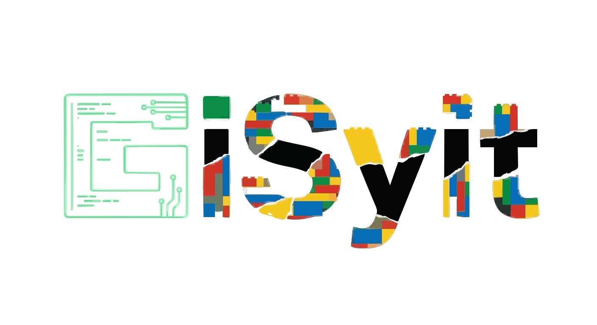

# Gisyit-apps

[中文版本](docs/README-CN.md) | [한국어](docs/README-KO.md) | [日本語](docs/README-JP.md)
> \[!NOTE]
>
> **Version Information**
>
> - **v0.01** (Stable): Available on the [`main`](https://github.com/SutBase/Gisyit/main) branch

## Project Overview

This is a **user-driven product experiment** where the platform's direction is determined by its community.

The project follows a **“idea crowdsourcing + execution by me”** model: users propose real needs and ideas, while I handle system architecture, engineering implementation, and continuous iteration. Feature priorities are entirely driven by community feedback and voting — no assumptions, no closed-door decisions.

---

## Background

The project originated not from a commercial plan, but from personal interest and experimentation. It is designed as a flexible environment to validate a **transparent, community-driven product development approach**.

- No strict deadlines or KPIs.  
- Quality, maintainability, and feasibility are prioritized over speed.

---

## Current Progress

- **400+ ideas and suggestions** collected from global users  
- **12 live applications** implemented  
- Multiple **free AI tools** already available  
- Continuous updates and expansions in progress  

All features follow a minimum standard of being **usable, maintainable, and reusable**.

---

## Existing Applications

Current and evolving tools include:

- **AI PPT**: Automatically generates structured, ready-to-use presentation content  
- **AI Table**: Converts complex data into readable, editable structured tables  
- **CloudNote**: Cloud-based structured note system for long-term use  
- **AI Studio**: Multi-model, multi-scenario AI experimentation and creation space  

These are **productivity-focused tools**, not entertainment toys.

---

## Co-Creation Principles

### 1. Idea Evaluation
Every idea is reviewed and assessed. Selection is based on:

- Technical feasibility  
- Scalability and long-term maintainability  
- Real-world value  

Popularity or trending status does **not** determine implementation. This is an **engineering-driven project**, not a wish list.

### 2. Pace & Expectations
- No guaranteed timelines or speed  
- Focused on quality, feasibility, and long-term maintenance  

### 3. Respect & Equality
- Every idea is respected, even if it’s just a short suggestion  
- Contribution is measured by the value of ideas, not effort or lines of code  

---

## Open Source & Ownership

Prior to this project, several applications were already open-sourced based on user feedback. After this project concludes:

- Contributors will be asked if they want their applications to be open-sourced  
- Open sourcing is **completely voluntary**, no obligation  

**Importantly:** any accepted idea will result in the **full source code being gifted** to the contributor. You will own the code, control it, and have final decision rights.

---

## Who Should Participate

You are encouraged to participate if you:

- Have real needs or ideas but lack engineering resources  
- Want to contribute to a **transparent, verifiable co-creation experiment**  

If you expect strict deadlines, KPIs, or commercial guarantees, this project may **not** be for you.

---

## Project Philosophy

- No promises to “change the industry”  
- No promises of fast success  

But every adopted idea will be **seriously considered** and exist as **real code**.  

This is a project that **builds first, evaluates later**. Join if you resonate with this approach.

---

## Socials / Contact

- **Douyin (TikTok China)**: HSX_Yico  
- **Bilibili**: 3632306092772310  
- **X (Twitter)**: @YIKELOVEHONGSHU
